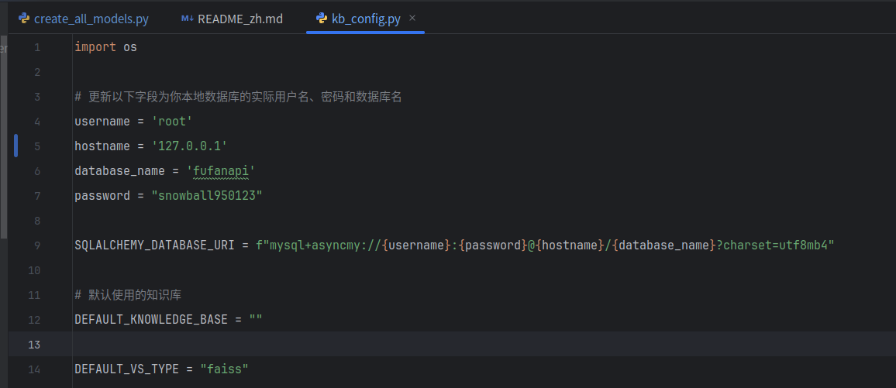

# 数据库mysql启动

```shell
(langchain) zj@zj-desktop:~/课件大模型与Agent开发实战课件/fufan-chat-api$ docker compose up
```

在mysql 中创建数据库

```
CREATE DATABASE fufanapi;
```

初始化表格

```
(langchain) zj@zj-desktop:~/课件大模型与Agent开发实战课件/fufan-chat-api$ python server/db/create_all_models.py
```

修改配置



配置数据库

(直接使用 faiss 可以不用这一步)下载YAML文件，并启动Milvus服务，如下所示：

```bash
(langchain) zj@zj-desktop:~/课件大模型与Agent开发实战课件/fufan-chat-api$ wget https://github.com/milvus-io/milvus/releases/download/v2.2.16/milvus-standalone-docker-compose.yml -O milvus_docker/docker-compose.yml
cd milvus_docker
sudo docker-compose up -d
```


初始化Faiss向量数据库

```
(langchain) zj@zj-desktop:~/课件大模型与Agent开发实战课件/fufan-chat-api$ python server/knowledge_base/init_vs.py
```

报错

```
sqlalchemy.exc.DataError: (asyncmy.errors.DataError) (1366, "Incorrect string value: '\\xE4\\xB8\\xAA\\xE4\\xBA\\xBA...' for column 'kb_info' at row 1")
[SQL: INSERT INTO knowledge_base (kb_name, kb_info, vs_type, embed_model, file_count, create_time, user_id) VALUES (%s, %s, %s, %s, %s, now(), %s)]
[parameters: ('private', '个人/公司私有知识库数据', 'faiss', 'bge-large-zh-v1.5', 0, '5adf6ed2-ec04-4593-bf4c-e1dd5f83637a')]
(Background on this error at: https://sqlalche.me/e/20/9h9h)
```

解决

```
-- 查看数据库字符集
SHOW CREATE DATABASE fufanapi;
-- 查看表字符集
SHOW CREATE TABLE knowledge_base;

# 修改代码, 所有mysql model加字段 __table_args__

```

```python
class UserModel(Base):
    __tablename__ = 'user'
    __table_args__ = {
        "mysql_charset": "utf8mb4",  # 设置字符集
        "mysql_collate": "utf8mb4_unicode_ci"  # 设置排序规则
    }
```

# 测试api_router

```

```


# 启动vLLM docker

```
docker run --rm --gpus all \
  -v /media/zj/data2-ext4/DeepSeek-R1-Distill-Llama-8B:/app/DeepSeek-R1-Distill-Llama-8B \
  -v ./cache/huggingface:/root/.cache/huggingface \
  -p 8000:8000 --ipc=host \
  vllm/vllm-openai:latest \
  --model /app/DeepSeek-R1-Distill-Llama-8B \
  --served-model-name DeepSeek-R1-Distill-Llama-8B \
  --dtype half \
  --max-model-len 1024
```

## 测试OpenAI 调用

```
import os
from openai import OpenAI

# 设置临时环境变量，处理代理问题
os.environ['http_proxy'] = ''
os.environ['https_proxy'] = ''
os.environ['all_proxy'] = ''

base_url = "http://localhost:8000/v1/"
client = OpenAI(api_key="EMPTY", base_url=base_url)

messages = [{"role": "user", "content": "你好，请你介绍一下你自己"}]

response = client.chat.completions.create(
    model="/app/model",
    messages=messages,
)

print(response.choices[0].message.content)
```

# 源码修改

修改配置文件  configs/model_config.py,

```
# 模型配置
    "openai-api": {
        "model_name": "DeepSeek-R1-Distill-Llama-8B",
        "api_base_url": "https://127.0.0.1:8000/v1",
        "api_key": "empty",
        "openai_proxy": "",
    },


    # 这里定义 本机服务器上存储的Embedding模型权重存储路径
    "embed_model": {
        "bge-large-zh-v1.5": "/media/zj/data2-ext4/BAAI/bge-large-zh-v1.5/BAAI/bge-large-zh-v1.5",
        # "m3e-base": "/home/00_rag/model/m3e-base",
        # 可扩展其他的Embedding模型
    },

    "reranker": {
        "bge-reranker-large": "/media/zj/data2-ext4/BAAI/bge-reranker-large/BAAI/bge-reranker-large",
    }
```


# 启动服务

启动报错1

```
ImportError: cannot import name 'cached_download' from 'huggingface_hub'
```

解决报错1

```
# 1.添加代码
import os
os.environ['HF_ENDPOINT'] = 'https://hf-mirror.com'  # 添加在导入CrossEncoder之前
# 2 升级  sentence-transformers
(langchain) zj@zj-desktop:~/课件大模型与Agent开发实战课件/fufan-chat-api$ pip install --upgrade sentence-transformers
```


## week2课程代码

```
(langchain) zj@zj-desktop:~/课件大模型与Agent开发实战课件/fufan-chat-api/code_version/v2$ git clone --branch v2.0.0 https://github.com/fufankeji/fufan-chat-api.git

git clone --branch v2.0.0 https://github.com/fufankeji/fufan-chat-api.git
```


## 配置用户和对话id作为测试用


````
以下是我用fastapi 写的大模型对话接口， 你帮我写一个单元测试.

代码片段
```
# 大模型对话接口
app.post("/api/chat",
         tags=["Chat"],
         summary="大模型对话交互接口",
         )
	......
```

````


# Demo记录

每一段文本， 都是 一个向量， 不管文档有多长。


# wiki数据处理


# 报错整理

报错1

```bash
(langchain) zj@zj-desktop:~/课件大模型与Agent开发实战课件/fufan-chat-api$ python /home/zj/课件大模型与Agent开发实战课件/fufan-chat-api/server/db/create_all_models.py
Traceback (most recent call last):
  File "/home/zj/课件大模型与Agent开发实战课件/fufan-chat-api/server/db/create_all_models.py", line 4, in <module>
    from configs import SQLALCHEMY_DATABASE_URI
ModuleNotFoundError: No module named 'configs'

```

解决1

```
export PYTHONPATH=$(pwd)
```


## windows报错

配置python的path

```powershell
(fufan-chat-api) D:\fufan-chat-api>pip install -qU langchain-deepseek

[notice] A new release of pip is available: 23.2.1 -> 25.0.1
[notice] To update, run: python.exe -m pip install --upgrade pip

(fufan-chat-api) D:\fufan-chat-api>python server\api_router.py
Traceback (most recent call last):
  File "D:\fufan-chat-api\server\api_router.py", line 8, in <module>
    from server.chat.chat import chat
ModuleNotFoundError: No module named 'server'

# 处理
(fufan-chat-api) D:\fufan-chat-api>set PYTHONPATH=%PYTHONPATH%;%cd%

(fufan-chat-api) D:\fufan-chat-api>echo %PYTHONPATH%
%PYTHONPATH%;D:\fufan-chat-api

```


